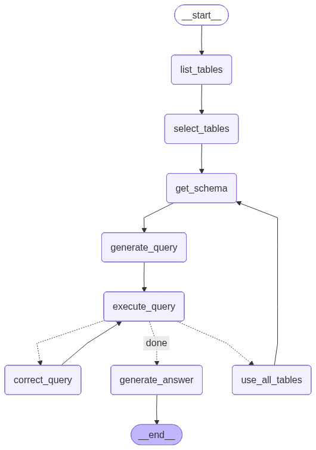
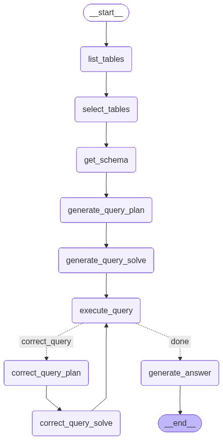
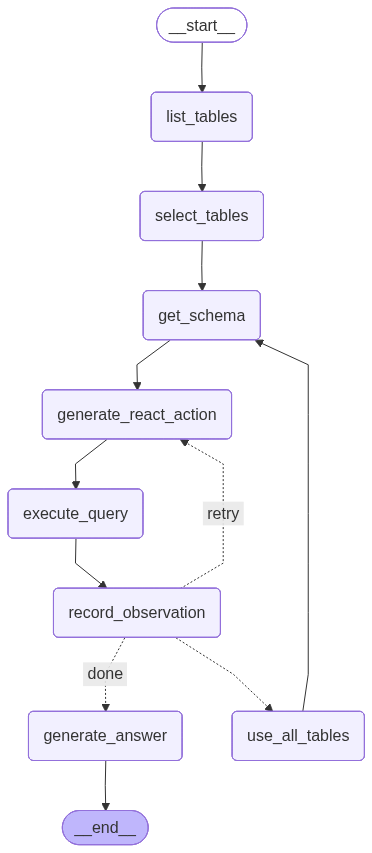

---
# pandoc dokumentacja-koncowa.md --citeproc -o dokumentacja-koncowa.pdf
lang: pl
bibliography: references.bib
nocite: "@*"
csl: ieee.csl
link-citations: true
---

# Dokumentacja końcowa

* Mikołaj Garbowski
* Mariusz Pakulski
* Paweł Łasica

## Definicja problemu

Badane zagadnienie to agent oparty na wielkim modelu językowym przeznaczony do konwersacyjnej analizy danych
ustrukturyzowanych.
Kluczowym komponentem takiego systemu jest zadanie text-to-SQL, czyli tłumaczenie zapytania użytkownika w języku
naturalnym na zapytanie SQL.
Agent ma możliwość wykonywania zapytań SQL w samej bazie danych, a także mechanizmy dostępu do informacji na temat
analizowanej bazy danych (np. schemat, przykładowe dane).

W ramach projektu porównujemy skuteczność różnych strategii agenta oraz różnych LLM na benchmarku Spider [@yu2018spider]

## Studia literaturowe

Zagadnienie wykorzystania modeli językowych do zastosowań z zakresu analizy danych i zadań BI dla baz relacyjnych jest
szeroko badane.
Typowe rozwiązania obejmują podejścia typu text-to-sql, a także text-to-python i text-to-dsl jako popularne alternatywy
do obrabiania ustrukturyzowanych danych [@tian2025tableagents].

W celu zrozumienia struktury tabeli, typowo dane tabelaryczne są serializowane do jakiejś postaci tekstowej (markdown,
json, itp.) co pozwala na bezpośrednie umieszczenie danych w prompcie, natomiast wyzwaniem jest ograniczony rozmiar
kontekstu.
Badane są także alternatywne podejścia, np. przetwarzanie obrazu tabeli modelami typu VLM, przetwarzanie tabeli w
postaci struktur grafowych, a także szczególnie interesujące: traktowanie danych tableraycznych jako odrędnej
modalności.
Przykładem takiego rozwiązania jest TableGPT2 [@su2024tablegpt2], które łączy koder danych tabelarycznych, produkujący
semantyczne osadzenia dla kolumn tabeli, połączony z modelem językowym typu tylko-dekoder wykorzystującym te osadzenia
oraz prompt użytkownika.

Sposobem na rozwiązanie problemu z rozmiarem kontekstu, wzbogacenie promptu użytkownika o wiedzę domenową, a także
wydobycie informacji o schemacie bazy danych, stosowane są metody znane z zastosowań typu RAG, zadania *retrieval*.

### Zbiory danych

Popularny zbiór WikiSQL [@zhong2017seq2sql] obejmuje proste zapytania SQL dotyczące pojedynczych tabel.

Bardziej złożone zapytania SQL (obejmujące złączenia, agregacje itp.) zawierają, znacznie większe zbiory,
Spider [@yu2018spider] i bardziej obszerny BIRD [@li2023bird].
rny Spider [@shi2024survey].

### Miary jakości

W literaturze stosowane są następujące miary jakości do oceny rozwiązań typu text-to-SQL:

- Execution accuracy [@shi2024survey] - Określa zgodność wyników zapytania wygenerowanego przez model z wynikami
  zapytania referencyjnego. Zapytanie uznaje się za poprawne, jeśli po wykonaniu na bazie danych zwraca taki sam
  rezultat jak zapytanie wzorcowe.

- Exact set match accuracy [@shi2024survey] - Polega na porównaniu struktury zapytania SQL wygenerowanego przez model z
  zapytaniem referencyjnym. Zapytanie uznaje się za poprawne, jeżeli wszystkie jego komponenty, takie jak SELECT, WHERE,
  GROUP BY czy ORDER BY, odpowiadają komponentom zapytania wzorcowego.

- Execution Accuracy per SQL Hardness [@yu2018spider] - Dzieli zapytania SQL według poziomu złożoności na cztery
  kategorie:

    * easy,
    * medium,
    * hard,
    * extra hard.

  Klasyfikacja ta opiera się na analizie struktury zapytania SQL, w szczególności na obecności:

    * złączeń tabel (JOIN),
    * grupowania danych (GROUP BY),
    * zapytań zagnieżdżonych,
    * operacji zbiorowych,
    * liczby warunków i agregacji.

- Component matching [@yu2018spider], [@pourreza2023dinsql] - Umożliwia analizę poprawności poszczególnych komponentów
  zapytania SQL takich jak:
    * SELECT,
    * WHERE,
    * GROUP BY,
    * ORDER BY,
    * JOIN,
    * nested SQL.

### Strategie agentów

Istnieje wiele strategii działania agenta, które różnią się sposobem generowania zapytań SQL, interakcją z bazą danych
oraz mechanizmami weryfikacji i poprawy błędów.
Niektóre z nich to:

- Plan and Solve [@wang2023planandsolve] - polega na rozdzieleniu procesu rozwiązywania problemu na dwa etapy -
  utworzenie planu rozwiązania i wykonanie zaplanowanych kroków. Model językowy najpierw generuje strukturę działania
  opisującą sposób rozwiązania zadania, a następnie realizuje kolejne kroki prowadzące do wygenerowania zapytania SQL.

- Chain-of-thought [@yao2022react] - klasyczna wersja polega na generowaniu rozwiązania poprzez sekwencję kroków rozumowania, bez
  bezpośredniej interakcji z narzędziami lub środowiskiem wykonawczym w trakcie procesu wnioskowania. Model językowy
  analizuje zapytanie użytkownika i generuje końcowe zapytanie SQL w jednym przebiegu.

- ReAct - Strategia ReAct (Reason and Act) [@yao2022react] łączy proces rozumowania z wykonywaniem akcji w środowisku
  zewnętrznym. Model językowy generuje kolejne kroki działania, wykonuje zapytania SQL lub operacje pomocnicze,
  analizuje wyniki ich wykonania oraz w razie potrzeby modyfikuje swoje decyzje.
  W projekcie zaimplementowano uproszczony wariant tej idei, nazwany ReAct-lite, w którym akcja została ograniczona do
  wygenerowania jednego zapytania SQL, a obserwacją jest wynik wykonania zapytania lub komunikat błędu.

### Self-correction zapytań SQL

W projekcie self-correction jest uruchamiany dopiero wtedy, gdy wygenerowane zapytanie SQL nie wykona się poprawnie albo
zostanie odrzucone przez walidator. Model otrzymuje wtedy pytanie użytkownika, schemat bazy, poprzednie zapytanie oraz
komunikat błędu i ma wygenerować poprawioną wersję SQL. Mechanizm ten jest stosowany zero-shot, bez dodatkowego trenowania
modelu na danych specyficznych dla zadania.

## Opis rozwiązania

Projekt obejmuje implementację agentów wykorzystujących różne strategie oraz porównanie ich skuteczności.

### Zbiór danych

Do ewaluacji jakości wykorzystujemy zbiór Spider.
WikiSQL uznajemy za nieodpowiedni dla naszego projektu, skoncentrowanego na bardziej złożonych zapytaniach
analitycznych.
BIRD byłby również dobrym wyborem, natomiast decydujemy się na Spider: również bardzo popularny i mniejszy, co ułatwi
nam pracę na ograniczonych zasobach sprzętowych.

### Baza danych

Integrujemy agenta z SQLite: uruchamianią lokalnie, relacyjną bazą danych.
Jest to typowy wybór przy tego typu zadaniach, używana w popularnych zbiorach
danych [@yu2018spider], [@zhong2017seq2sql], [@li2023bird].

### Plan eksperymentów

Porównujemy skuteczność trzech strategii generowania zapytań SQL:

* Chain-of-Thought,
* Plan-and-Solve,
* ReAct-lite, czyli uproszczonego wariantu ReAct z iteracyjną korektą zapytań SQL.

Dla każdej strategii analizujemy execution accuracy, exact match accuracy oraz metryki partial matching dla komponentów
SQL. Główne wyniki liczymy na zbiorze testowym Spider obejmującym 2147 przykładów. Dodatkowo używamy próbki
`diagnostic_test_40`, zrównoważonej po poziomach trudności, do szybkiego testowania zmian w promptach i postprocessingu.

Podstawowe eksperymenty wykonujemy na dwóch małych modelach uruchamianych lokalnie:

* [Qwen/Qwen2.5-1.5B-Instruct](https://huggingface.co/Qwen/Qwen2.5-1.5B-Instruct),
* [meta-llama/Llama-3.2-1B-Instruct](https://huggingface.co/meta-llama/Llama-3.2-1B-Instruct).

Dodatkowo testujemy większy model `qwen/qwen3-32b` przez API Groq, aby sprawdzić wpływ jakości modelu na te same strategie.
Wariant ReAct-lite uruchamiamy z dwiema próbami korekty, co stanowi kompromis między self-correction a czasem inferencji.

## Implementacja

### Platforma

Modele lokalne uruchamiamy z wykorzystaniem biblioteki `transformers` oraz adapterów HuggingFace. Daje to kontrolę nad
modelem, tokenizerem i parametrami generowania, ale ogranicza wybór modeli do takich, które mieszczą się w pamięci GPU.

Dodatkowo dodano adapter do API Groq dla modelu `qwen/qwen3-32b`. Prompt nadal jest definiowany w naszym kodzie, natomiast
Groq służy wyłącznie jako zewnętrzna warstwa inferencji. Dla tego modelu zastosowano format SQL-only, aby uniknąć
zapisywania w predykcjach komentarzy lub znaczników reasoningowych. Przetestowano `qwen/qwen3-32b` dla wszystkich opisanych wariantów rozumowania.

### Narzędzia

- langchain/langgraph [@langchainsqlagent], [@langgraphsqlagent] - biblioteki dostarczaczające rozwiązania dotyczące
  budowania promptów, agentów oraz zdolności rozumowania
- transformers - biblioteka ułatwiająca pracę z wielkimi modelami językowymi
- pytorch - biblioteka ogólnego przeznaczona do działań głębokiego uczenia oraz tensorów

### Przepływ działania agenta
Ogólny schemat działania agenta jest przedstawiony poniżej.
Konkretne warianty wprowadzają pewne modyfikacje do tego schematu, ale ogólna struktura pozostaje zbliżona.

| Krok | Komponent         | Rola                                                                                    |
|-----:|-------------------|-----------------------------------------------------------------------------------------|
|    1 | `list_tables`     | Pobranie listy tabel dostępnych w bazie danych.                                         |
|    2 | `select_tables`   | Wybór tabel istotnych dla pytania użytkownika.                                          |
|    3 | `get_schema`      | Pobranie schematu wybranych tabel.                                                      |
|    4 | `generate_query`  | Wygenerowanie zapytania SQLite `SELECT`.                                                |
|    5 | `execute_query`   | Sprawdzenie bezpieczeństwa i wykonanie zapytania.                                       |
|    6 | `use_all_tables`  | Awaryjne użycie pełnego schematu, jeżeli wcześniejszy wybór tabel był niewystarczający. |
|    7 | `correct_query`   | Korekta zapytania na podstawie błędu.                                                   |
|    8 | `generate_answer` | Wygenerowanie krótkiej odpowiedzi dla użytkownika.                                      |

W trybie ewaluacyjnym agent może kończyć działanie po wygenerowaniu i ewentualnej korekcie SQL.
Jest możliwość wygenerowania odpowiedzi dla użytkownika w języku naturalnym, ale nie podlega to ocenie w benchmarku.

### Wariant Chain-of-Thought

Zaimplementowany wariant Chain-of-Thought dodaje do generowania SQL krótki plan zapisany w bloku `<think>...</think>`. Używa wspólnego dla wszystkich strategii kroku schema linking (`list_tables` + `select_tables` z fallbackiem na pełny schemat), a właściwa modyfikacja CoT dotyczy tylko prompta w węźle `generate_query`. Plan ma zawierać maksymalnie kilka krótkich informacji:

  * `tables` — istotne tabele,
  * `joins` — potrzebne złączenia,
  * `filters` — warunki filtrujące,
  * `aggregation_ordering` — `GROUP BY` / `HAVING` / `ORDER BY` / `LIMIT`,
  * `output` — zwracane kolumny lub wyrażenia agregujące.

Po planie model zwraca jedno zapytanie SQL `SELECT`. Implementacja wyodrębnia plan do osobnego pola diagnostycznego `reasoning_trace`,
usuwa go z odpowiedzi modelu i zapisuje samo zapytanie SQL do ewaluacji. Dzięki temu można analizować sposób planowania
modelu, ale format predykcji pozostaje zgodny z wymaganiami benchmarku.

Dla `qwen/qwen3-32b` zastosowano wariant SQL-only — model jest proszony o myślenie wewnętrzne bez wypisywania reasoningu, a pole `reasoning_trace` pozostaje wtedy puste.

W razie błędu wykonania lub odrzucenia przez walidator bezpieczeństwa, agent uruchamia wspólny węzeł
`correct_query` (domyślnie do dwóch prób). Korektor otrzymuje pytanie, schemat, poprzedni SQL i komunikat
błędu — plan z `<think>` nie jest mu udostępniany.

Wariant CoT uruchamiamy flagą  `--reasoning-mode cot`.

### Wariant Plan and Solve

Wariant Plan and Solve rozdziela proces generowania zapytania SQL na dwa etapy: planowanie i rozwiązanie.

Krok planowania zawiera w prompcie informacje o pytaniu użytkownika, nazwach i schematach istotnych tabel,
wynikiem jest tekstowy plan rozwiązania.

Krok rozwiązanie ma za zadanie wyprodukowanie zapytania SQL, korzystając z informacji o pytaniu użytkownika,
nazwach i schematach istotnych tabel, a także z wygenerowanego wcześniej planu.

W przypadku błędu, poprawa zapytania również jest rozbita na dwa etapy.
Prompt jest dodatkowo wzbogacony o komunikat błędu, plan i zapytanie SQL, które spowodowały błąd.
Model ma za zadanie wygenerować poprawiony plan, a następnie poprawione zapytanie SQL.

### Wariant ReAct-lite

ReAct-lite jest uproszczonym wariantem ReAct, w którym jedyną akcją modelu jest wygenerowanie zapytania SQLite `SELECT`.
Pojedyncza iteracja składa się z trzech elementów:

* rozumowania nad pytaniem użytkownika, schematem i historią poprzednich prób,
* akcji, czyli wygenerowania jednego zapytania SQL,
* obserwacji, czyli wyniku wykonania zapytania albo komunikatu błędu.

Jeżeli zapytanie zakończy się błędem, agent zapisuje poprzednie `Thought/Action/Observation` w historii i generuje kolejną
próbę. W przeciwieństwie do CoT korekta korzysta więc nie tylko z błędnego SQL, ale również z wcześniejszego rozumowania i
obserwacji. W przeciwieństwie do Plan-and-Solve nie powstaje oddzielny, stały plan przed wykonaniem zapytania.

Dla modeli lokalnych dopuszczono format `Thought: ...` oraz `SQL: ...`. Dla `groq-qwen3-32b` użyto wariantu SQL-only,
ponieważ widoczne uzasadnienia mogły zakłócać ewaluację Spidera.

### Algorytm self-correction

Self-correction jest uruchamiany, gdy zapytanie nie wykona się poprawnie albo zostanie odrzucone przez walidator
bezpieczeństwa. Dla błędów typu `no such column` lub `no such table` agent może najpierw przełączyć się na pełny schemat
bazy, ponieważ pierwotnie wybrane tabele mogły być niewystarczające.

Następnie model otrzymuje:

- pytanie użytkownika,
- schemat bazy danych,
- poprzednie zapytanie SQL,
- komunikat błędu.

Na tej podstawie generuje poprawione zapytanie. Domyślnie liczba prób korekty jest ograniczona, na przykład do dwóch.
Pozwala to porównać wariant bez korekty, wariant z jedną próbą oraz wariant z większą liczbą prób.

### Postprocessing zapytań SQL

Przed zapisaniem predykcji odpowiedź modelu jest czyszczona, aby do ewaluacji trafiło wyłącznie zapytanie SQL. Jest to
potrzebne, ponieważ modele potrafią zwracać komentarze, markdown, fragmenty rozumowania albo znaczniki typu `<think>`.

Zaimplementowany postprocessing:

* usuwa bloki rozumowania, markdown i tekst przed właściwym `SELECT`,
* normalizuje aliasy tabel do formy z jawnym `AS`,
* usuwa backticki i aliasy kolumn wynikowych,
* odcina tekst po końcowym zapytaniu.

Dzięki temu parser Spidera ocenia wygenerowany SQL, a nie dodatkowy tekst znajdujący się w odpowiedzi modelu.

### Struktura kodu źródłowego

* `agent` - pakiet z implementacją agenta
    * `common` - komponenty wspólne dla wszystkich wariantów agenta
      * `agent` - abstrakcyjna klasa bazowa agenta
      * `llm` - interfejs i konkretne adaptery do modeli językowych
      * `logging_config` - konfiguracja logowania
      * `modes` - definicja wariantów agenta
      * `nodes` - węzły grafu agenta
      * `state` - bazowy interfejs dla stanu agenta
      * `utils` - funkcje pomocnicze
    * `chain_of_thought` - implementacja wariantu Chain-of-Thought
      * `agent` - implementacja agenta
      * `nodes` - implementacja węzłów specyficznych dla tego wariantu
      * `state` - stan agenta specyficzny dla tego wariantu
    * `plan_and_solve` - implementacja wariantu Plan and Solve
      * `agent`, `nodes`, `state`
    * `react_lite` - implementacja wariantu ReAct-lite
      * `agent`, `nodes`, `state`
    * `agent` - budowanie agenta, skrypt demonstracyjny
    * `make_predictions` - skrypt do generowania predykcji dla zbioru Spider
* `eval` - moduł do ewaluacji wygenerowanych predykcji
    * kod zapożyczony z repozytorium https://github.com/taoyds/spider

## Instrukcja obsługi

* Do zarządzania projektem Python, zależnościami: [uv](https://docs.astral.sh/uv/)
* Do wykonywania komend: [just](https://github.com/casey/just)
* Wszystkie komendy opisane w `Justfile`
    * lista wszystkich dostępnych `just -l`
    * opis skryptów `just <komenda> --help`
    * komendy uruchamiane np. `just test`
* Instalacja zależności: `just install`
* Pobranie zbiorów danych `just datasets`
* Demonstracyjne uruchomienie agenta, z odpowiedzią w języku naturalnym: `just agent`
* Przeprowadzenie ewaluacji
    * `just make_predictions` - generuje za pomocą agenta zapytania SQL dla zapytań w języku naturalnym i baz danych ze
      zbioru Spider.
    * `just eval` - oblicza miary jakości porównując wygenerowane i wzorcowe zapytania SQL

## Testy
TODO opracowanie wyników benchmarków
TODO przykładowe zapytania
TODO porównanie z literaturą

## Wnioski
TODO

## Bibliografia
